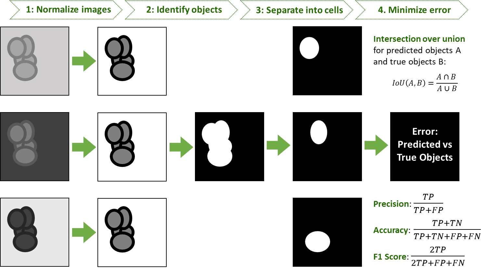

# Identifying Cell Nuclei in Divergent Images

Final project for ChBE 8803, based on Kaggle challenge: https://www.kaggle.com/c/data-science-bowl-2018

Training data: https://www.kaggle.com/c/data-science-bowl-2018/data

Milestones:
* 02/02/18 - Project proposal draft
* 02/09/18 - Data retrieval and storage 
* 02/16/18 - Proposal revision and literature review 
* 03/01/18 - Initial workflow and peer review 
* 03/30/18 - Final report draft 
* 04/17/18 - Presentation
* 04/24/18 - Final report

### 1 Background
Pathologists use immunohistochemistry (IHC) to detect tumours by identifying and quantifying the presence of
important biomarkers expressed in cell nuclei. However, manual identification is time-consuming, thus it is highly
desirable to develop an automated, high-accuracy method for isolating and analyzing nuclei in different kinds of
IHC images.

### 2 Data Description & Challenge
The dataset is challenging because of high volume and dimensionality. Our data is divided into a training set
(665 images, each containing between 4 to 384 masks for distinct nuclei) and test set (65 images). The images
vary in size (total pixels) and were collected from many different cell types under a variety of imaging conditions
(magnification, modality, etc). To achieve success, we will have to work with all the given data to develop a robust
method for cell nucleus identification.

### 3 Hypotheses & Goals
#### Goal 1. Normalize across set of images.
The variety of cell type, staining and imaging condition all complicate cell identication. Pre-processing the data
will ensure comparison across uniform images.
#### Goal 2. Detect all objects in each image.
We will separate objects from background, categorizing each pixel as ground or non-ground.
#### Goal 3. Separate individual cell nuclei. Once we have distinguished all objects as distinct from ground, the
next step is to determine individual cells. For each image, we will return a set of masks, each mask only covering
one nucleus with no overlap between any of the masks.
#### Goal 4. Maximize performance.
We will consider statistical metrics important in binary classification (accuracy, precision, and the F1 score), as
well as average precision in image classification as measured by the Jaccard index (also called the intersection over
union) for a set of predicted pixels A and a set of true object pixels B.

### 4 Definition of Success
Success is a defined as a work
ow that consists of pre-processing to normalize variation in imaging condition,
separating objects from background in each image, and distinguishing individual cell nuclei. The differences in
low, expected and high success are based on model performance as follows.
#### Low: Accomplish Goals 1-2. For Goal 3, predict nuclei regardless of accuracy.
#### Expected: Accomplish Goals 1-3. For Goal 4, achieve
* at least 60% accuracy, precision, F1 score
* at least 50% IoU
#### High: Accomplish Goals 1-3. For Goal 4, achieve
* at least 80% accuracy, precision, F1 score
* at least 65% IoU

### 5 Deliverables
The key deliverable will be a Jupyter notebook containing:
* Code to normalize the data from different imaging conditions
* Code to detect objects in the image
* Code to identify individual nuclei
* Documentation of the inputs and outputs of all functions
* Quantitative assessment of model accuracy
* Written critical analysis of successes/failures of the model

